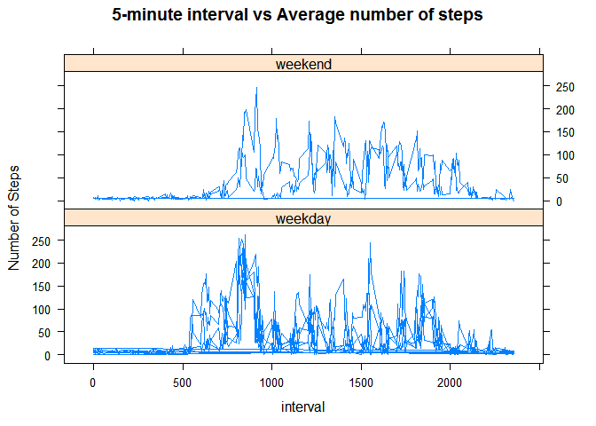

# Reproducible Research: Peer Assessment 1


## I. Loading and preprocessing the Activity Monitoring data


```r
library(data.table) # used for data analysis.
```

```
## Warning: package 'data.table' was built under R version 3.1.2
```

```r
library(lattice) # used to make a panel plot.
```

```
## Warning: package 'lattice' was built under R version 3.1.2
```

```r
activity <- read.csv("activity.csv", na.strings = c("NA"))

activity_with_NA <- data.table(activity)
activity_data <- data.table(na.omit(activity))
```

## II. What is mean total number of steps taken per day?

```r
# 1. Make a histogram of the total number of steps taken each day
activity_total_steps <- activity_data[, lapply(.SD, sum), by = date,  .SDcols=c("steps")]

#png(file = "./figure/total_number_of_steps.png",width=500,height=500,units="px")

hist(activity_total_steps$steps)
```

 

```r
#dev.off()

# 2. Calculate and report the mean and median total number of steps taken per day
mean_activity_total_steps <- activity_total_steps[, lapply(.SD, mean), .SDcols=c("steps")]
mean_activity_total_steps
```

```
##       steps
## 1: 10766.19
```

```r
median_activity_total_steps <- activity_total_steps[, lapply(.SD, median), .SDcols=c("steps")]
median_activity_total_steps
```

```
##    steps
## 1: 10765
```


## III. What is the average daily activity pattern?


```r
# 1. Make a time series plot (i.e. type = "l") of the 5-minute interval (x-axis) and 
# the average number of steps taken, averaged across all days (y-axis)
mean_activity_steps <- activity_data[, lapply(.SD, mean), by = interval,  .SDcols=c("steps")]

#png(file = "./figure/5-minute_interval_vs_steps.png",width=500,height=500,units="px")

with(mean_activity_steps, plot(interval, steps, 
                               main = "5-minute interval vs the average number of steps taken", type = "l"))
```

 

```r
#dev.off()

# 2. Which 5-minute interval, on average across all the days in the dataset, 
# contains the maximum number of steps?
mean_activity_max_steps_value <- max(mean_activity_steps$steps)
mean_activity_max_steps_interval  <- mean_activity_steps[c( mean_activity_steps[,  grep(mean_activity_max_steps_value, steps)]  ), .(interval, steps)]

### Answer:  the following outputs the 5-minute interval that contains the maximum number of steps
mean_activity_max_steps_interval
```

```
##    interval    steps
## 1:      835 206.1698
```

## IV. Imputing missing values

```r
# 1 . Calculate and report the total number of missing values in the dataset (i.e. the total number of rows with NAs)
activity_NA <- subset(activity, is.na(activity$steps))
total_number_of_missing_values <- nrow(activity_NA)
total_number_of_missing_values
```

```
## [1] 2304
```

```r
# 2.Devise a strategy for filling in all of the missing values in the dataset. The strategy does not need to be sophisticated. 
# For example, you could use the mean/median for that day, or the mean for that 5-minute interval, etc.

### Strategy: calulate the mean for the day in the 5-minute interval as follows and use that to find and replace
### each NA as shown in part 3. bleow.
mean_of_day_activity_with_NA_steps <- activity_data[, lapply(.SD, mean), by = date,  .SDcols=c("steps") ][, steps]


# 3. Create a new dataset that is equal to the original dataset but with the missing data filled in.
# Replace NA with the mean of the day. Note: recycled warning message will be printed.

### Note using below the code: activity_data[, lapply(.SD, mean), by = date,  .SDcols=c("steps") ][, steps] 
### from part 2 above and that is code: mean_of_day_activity_with_NA_steps

activity_with_NA_filled <-  activity_with_NA[is.na(steps), steps := as.integer(activity_data[, lapply(.SD, mean), by = date,  .SDcols=c("steps") ][, steps]) ]
```

```
## Warning in `[.data.table`(activity_with_NA, is.na(steps), `:=`(steps,
## as.integer(activity_data[, : Supplied 53 items to be assigned to 2304
## items of column 'steps' (recycled leaving remainder of 25 items).
```

```r
activity_with_NA_filled 
```

```
##        steps       date interval
##     1:     0 2012-10-01        0
##     2:    39 2012-10-01        5
##     3:    42 2012-10-01       10
##     4:    46 2012-10-01       15
##     5:    53 2012-10-01       20
##    ---                          
## 17564:    30 2012-11-30     2335
## 17565:    29 2012-11-30     2340
## 17566:     8 2012-11-30     2345
## 17567:    23 2012-11-30     2350
## 17568:    35 2012-11-30     2355
```

```r
# 4 . Make a histogram of the total number of steps taken each day and Calculate and report the mean and median total 
# number of steps taken per day. Do these values differ from the estimates from the first part of the assignment? 
# What is the impact of imputing missing data on the estimates of the total daily number of steps?

activity_with_NA_filled_total_steps <- activity_with_NA_filled[, lapply(.SD, sum), by = date,  .SDcols=c("steps")]

#png(file = "./figure/activity_with_NA_filled_total_steps.png",width=500,height=500,units="px")

hist(activity_with_NA_filled_total_steps$steps)
```

 

```r
#dev.off()

mean_activity_with_NA_filled_total_steps <- activity_with_NA_filled_total_steps[, lapply(.SD, mean), .SDcols=c("steps")]
mean_activity_with_NA_filled_total_steps
```

```
##       steps
## 1: 10748.31
```

```r
median_activity_with_NA_filled_total_steps <- activity_with_NA_filled_total_steps[, lapply(.SD, median), .SDcols=c("steps")]
median_activity_with_NA_filled_total_steps
```

```
##    steps
## 1: 10653
```

```r
### ANSWER: yes these values of mean and median are different from the values obtained from the dataset with NA removed.
### But the difference does not make a big impact on the analysis of the original data.set.
```


## V. Are there differences in activity patterns between weekdays and weekends?

```r
# 1. Create a new factor variable in the dataset with two levels – “weekday” and “weekend” 
# indicating whether a given date is a weekday or weekend day.

activity_with_NA_filled_day <-  activity_with_NA_filled[,day:=weekdays(as.IDate(date))]
activity_with_NA_filled_day_total_steps <- activity_with_NA_filled_day[, lapply(.SD, mean), by = .(interval=interval, day=day),  .SDcols=c("steps")]


activity_with_NA_filled_day_total_steps[,day := as.character(day)][day=="Monday" | day=="Tuesday" | day=="Wednesday" | day=="Thursday" | day=="Friday", day := "weekday"]
```

```
##       interval     day     steps
##    1:        0 weekday  3.666667
##    2:        5 weekday  8.222222
##    3:       10 weekday  9.000000
##    4:       15 weekday  7.000000
##    5:       20 weekday  9.666667
##   ---                           
## 2012:     2335  Sunday 23.375000
## 2013:     2340  Sunday 17.125000
## 2014:     2345  Sunday  7.875000
## 2015:     2350  Sunday  3.125000
## 2016:     2355  Sunday  0.000000
```

```r
activity_with_NA_filled_day_total_steps[,day := as.character(day)][day=="Saturday" | day=="Sunday", day := "weekend"]
```

```
##       interval     day     steps
##    1:        0 weekday  3.666667
##    2:        5 weekday  8.222222
##    3:       10 weekday  9.000000
##    4:       15 weekday  7.000000
##    5:       20 weekday  9.666667
##   ---                           
## 2012:     2335 weekend 23.375000
## 2013:     2340 weekend 17.125000
## 2014:     2345 weekend  7.875000
## 2015:     2350 weekend  3.125000
## 2016:     2355 weekend  0.000000
```

```r
# 2. Make a panel plot containing a time series plot (i.e. type = "l") of the 5-minute interval (x-axis) 
# and the average number of steps taken, averaged across all weekday days or weekend days (y-axis). 

attach(activity_with_NA_filled_day_total_steps)

# create factor day.f
day.f <-factor(day,levels=c("weekday", "weekend"),
               labels=c("weekday","weekend"))

#png(file = "./figure/panel_plot_weeday_weekend.png",width=500,height=500,units="px")

xyplot(steps ~ interval | day.f, layout = c(1, 2), type = "l", 
       main="5-minute interval vs Average number of steps",
       ylab="Number of Steps", 
       )
```

 

```r
#dev.off()
### Answer: Yes as we can see from the panel plot there are differences in 
### activity patterns between weekdays and weekends.
```
